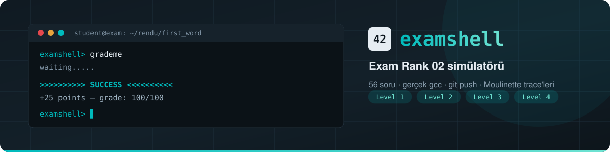

<div align="center">



<br>

**42 İstanbul Exam Rank 02 sınavını birebir taklit eden simülatör.**
Gerçek `gcc`, gerçek `git push`, gerçek Moulinette trace'leri.

<br>


<br>

[Kurulum](#-kurulum) &nbsp;·&nbsp;
[Hızlı başlangıç](#-hızlı-başlangıç) &nbsp;·&nbsp;
[CLI](#-cli-kullanımı) &nbsp;·&nbsp;
[Web](#-web-sürümü) &nbsp;·&nbsp;
[Değerlendirme](#-değerlendirme-nasıl-çalışır) &nbsp;·&nbsp;
[Öneriler](#-sınava-çalışma-önerileri) &nbsp;·&nbsp;
[SSS](#-sorun-giderme)

</div>

---

## ✦ Neler var

|  | |
|---|---|
| 🖥️ **CLI sürümü** | Terminalde çalışan `examshell`. Senin makinendeki gerçek `gcc` ve `git` ile değerlendirir. |
| 🌐 **Web sürümü** | Tek HTML dosyası. Kurulum yok; tarayıcı içinde çalışan bir C derleyicisi/yorumlayıcısı içerir. |
| 📝 **Birebir sorular** | 56 egzersizin subject metni repodakiyle aynı — İngilizce ve İspanyolca. |
| 🔒 **Yasak fonksiyon kontrolü** | `nm` ile sembol denetimi; `printf`'i gizleyemezsin. |
| 🧾 **Gerçek trace'ler** | `diff -U 3 ... \| cat -e` formatında, dosyaya yazılan Moulinette çıktısı. |
| 🎛️ **Ayarlanabilir akış** | Süre, git zorunluluğu ve başarısızlık davranışı (`new` / `same` / `ask`). |

<br>

<div align="center">

<br><em>Web sürümü: solda subject, ortada editör, altta examshell terminali.</em>
</div>

---

## ⚙ Kurulum

### Gereksinimler

| Araç | Neden gerekli | Ubuntu paketi |
|---|---|---|
| **Node.js ≥ 12** | examshell'i çalıştırmak | `nodejs` |
| **gcc** | kodunu derlemek | `build-essential` |
| **git** | rendu'yu push etmek | `git` |
| **nm** | yasak fonksiyon kontrolü | `binutils` |

### Kurulum

```bash
tar xzf examshell.tar.gz
cd examshell
./install.sh
```

`install.sh` eksik paketleri apt ile kurar ve `examshell`'i `~/.local/bin` altına yerleştirir.

> [!TIP]
> Kurulum yapmak istemiyorsan tek dosya yeter: `chmod +x examshell && ./examshell`

---

## ⚡ Hızlı başlangıç

Gerçek sınavdaki gibi **iki terminal** kullan.

<table>
<tr>
<th align="left" width="50%">1️⃣ &nbsp;Terminal — examshell</th>
<th align="left" width="50%">2️⃣ &nbsp;Terminal — kod</th>
</tr>
<tr valign="top">
<td>

```console
$ examshell

Assignment: first_word  (level 1)
Subject:    ~/exam_rank02/subjects/…
Turn in:    ~/exam_rank02/rendu/first_word/
Allowed:    write

examshell> grademe
Are you sure you want to continue? (y/n) y
waiting.....

>>>>>>>>>> SUCCESS <<<<<<<<<<
+25 points — grade: 25/100
```

</td>
<td>

```bash
cd ~/exam_rank02/rendu/first_word
vim first_word.c

cc -Wall -Wextra -Werror first_word.c
./a.out "  hello world" | cat -e

cd ~/exam_rank02/rendu
git add .
git commit -m "first_word"
git push
```

</td>
</tr>
</table>

---

## 🖥 CLI kullanımı

### Seçenekler

| Seçenek | Açıklama |
|---|---|
| *(yok)* | Kayıtlı oturum varsa devam eder, yoksa yeni sınav başlatır |
| `--new` | Yeni gerçek sınav başlatır — ⚠️ `rendu` klasörünü siler |
| `--practice [soru]` | Pratik modu, süre yok. İsim verilmezse rastgele |
| `--time <dakika>` | Sınav süresi (varsayılan `180`) |
| `--fail <new\|same\|ask>` | Başarısız olunca ne olacağı (varsayılan `new`) |
| `--no-git` | Push gerekmez, çalışma dosyaları değerlendirilir |
| `--dir <klasör>` | Çalışma alanı (varsayılan `~/exam_rank02`) |
| `--list` | 56 sorunun listesi |
| `--version` · `--help` | |

### examshell komutları

| Komut | Ne yapar |
|---|---|
| `grademe` | Push edilen rendu'yu değerlendirir |
| `status` | Süre, puan, level, mevcut soru ve ayarlar |
| `subject` | Subject'i basar — `subject es` İspanyolcası |
| `policy [new\|same\|ask]` | Başarısızlık davranışını gösterir / değiştirir |
| `finish` | Sınavı bitirir ve sonuç tablosunu basar |
| `exit` | Çıkar; oturum kaydedilir, tekrar açınca devam eder |
| `clear` · `help` | |

Pratik modunda ayrıca: `next` · `practice <isim>` · `list`

### Başarısız olunca ne olsun?

```console
examshell> policy ask

>>>>>>>>>> FAILURE <<<<<<<<<<
You have failed the assignment "ulstr": test 3: çıktı farklı
Şimdi ne olsun? [s] aynı soruyu (ulstr) tekrar dene / [y] aynı level'dan yeni soru:
```

| Değer | Davranış |
|---|---|
| `new` | Aynı level'dan yeni bir soru gelir *(varsayılan)* |
| `same` | Aynı soru kalır, dosyaların durur |
| `ask` | Her başarısızlıkta sana sorulur |

### Çalışma alanı

```
~/exam_rank02/
├── rendu/                  # git reposu — kodunu buraya yaz
│   └── <soru>/
├── subjects/
│   └── <soru>/subject.en.txt · subject.es.txt
├── traces/                 # her grademe'nin trace dosyası
├── .vogsphere.git          # push ettiğin bare repo (değerlendirilen kaynak)
└── .state.json             # oturum durumu
```

> [!NOTE]
> Süre, sen `exit` ile çıkmışken de işlemeye devam eder — tıpkı gerçek sınavdaki gibi.

---

## 🌐 Web sürümü

Kurulum gerekmez, tek dosya:

```bash
xdg-open exam-rank-02.html
```

Terminal paneli gerçek bir shell gibi davranır:

```bash
cc -Wall -Wextra -Werror first_word.c -o fw && ./fw "  hello world" | cat -e
echo $?
valgrind ./fw
git add . && git commit -m "rendu" && git push
```

<details>
<summary><b>Desteklenen komutlar ve kısayollar</b></summary>

<br>

**Komutlar:** `cc` / `gcc` / `clang` · `./program` · `valgrind` · `git` (add, commit, push, status, log) · `ls` · `cd` · `pwd` · `cat` (`-e`) · `touch` · `rm` · `mkdir` · `vim` (dosyayı editörde açar) · `echo` · `history` · `clear` · `grademe` · `status` · `subject` · `policy` · `finish`

**Kısayollar:** `Tab` tamamlama · `↑` / `↓` komut geçmişi · `Ctrl+L` temizle · `Ctrl+C` iptal

**Editör:** dosya sekmeleri, satır numaraları, söz dizimi renklendirmesi, otomatik girinti, `Tab` ile gerçek tab karakteri. Push edilmemiş dosyalar sekmede turuncu noktayla işaretlenir.

Oturum tarayıcıda saklanır; sayfayı yenilersen "Kaldığın yerden devam et" ile dönersin.

</details>

<div align="center">

<br><em>Başarısızlıkta trace: hangi test, hangi komut, beklenen ve alınan çıktı.</em>
</div>

---

## 🔍 Değerlendirme nasıl çalışır

`grademe` şu sırayla ilerler ve **ilk başarısız adımda durur** — tıpkı Moulinette gibi:

```
   ①  Dosya kontrolü  →  ②  Derleme  →  ③  Yasak fonksiyon  →  ④  Testler
      Expected files      -Wall            nm -u ile              çıktı diff'i
      birebir aranır      -Wextra          sembol denetimi        + crash / timeout
                          -Werror
```

<details>
<summary><b>Adımların ayrıntısı</b></summary>

<br>

**① Dosya kontrolü** — subject'teki `Expected files` adları birebir aranır. `*.c, *.h` diyen sorularda klasördeki tüm `.c`/`.h` dosyaları alınır.

**② Derleme** — `gcc -Wextra -Wall -Werror <dosyalar> -o user_exe`. Fonksiyon sorularında gizli bir test `main`'i eklenir; teslim ettiğin dosyada `main` varsa `multiple definition of main` alırsın.

**③ Yasak fonksiyon** — CLI'da `gcc -c -fno-builtin` ile üretilen nesne dosyasında `nm -u` çalıştırılır; tanımsız semboller `Allowed functions` listesiyle karşılaştırılır. Web sürümünde aynı kontrol yorumlayıcının çağrı kaydı üzerinden yapılır.

**④ Testler** — subject'teki örnekler ve kenar durumlar çalıştırılır. Segfault, abort ve zaman aşımı yakalanır; çıktı bayt bayt karşılaştırılır.

</details>

Başarısızlıkta 42 formatında trace üretilir:

```diff
= Test 7 =======================================================================
$> ./user_exe "\t\t  hello\tworld"
$> diff -U 3 user_output_test7 test7.output | cat -e
--- user_output_test7
+++ test7.output
@@ -1,1 +1,1 @@
-\t\t$
+hello$

Diff KO :(
Grade: 0
```

Trace dosyaları: CLI'da `~/exam_rank02/traces/`, web sürümünde `~/traces/` (`cat ~/traces/0-first_word.trace`).

> [!IMPORTANT]
> Beklenen çıktılar, repodaki referans çözümlerin gerçek `gcc` ile çalıştırılmasıyla üretildi. 56 referans çözümün tamamı her iki sürümde de `SUCCESS` alıyor; web sürümündeki derleyici bu testlerin hepsinde gcc ile aynı çıktıyı ve aynı exit code'u veriyor.

---

## 📚 Soru havuzu

<div align="center">

| Level | Sayı | Puan |
|:--:|:--:|:--:|
| 1 | 12 | +25 |
| 2 | 19 | +25 |
| 3 | 15 | +25 |
| 4 | 10 | +25 |

</div>

<details>
<summary><b>56 sorunun tamamı</b></summary>

<br>

**Level 1** — `first_word` `fizzbuzz` `ft_putstr` `ft_strcpy` `ft_strlen` `ft_swap` `repeat_alpha` `rev_print` `rot_13` `rotone` `search_and_replace` `ulstr`

**Level 2** — `alpha_mirror` `camel_to_snake` `do_op` `ft_atoi` `ft_strcmp` `ft_strcspn` `ft_strdup` `ft_strpbrk` `ft_strrev` `ft_strspn` `is_power_of_2` `last_word` `max` `print_bits` `reverse_bits` `snake_to_camel` `swap_bits` `union` `wdmatch`

**Level 3** — `add_prime_sum` `epur_str` `expand_str` `ft_atoi_base` `ft_list_size` `ft_range` `ft_rrange` `hidenp` `lcm` `paramsum` `pgcd` `print_hex` `rstr_capitalizer` `str_capitalizer` `tab_mult`

**Level 4** — `flood_fill` `fprime` `ft_itoa` `ft_list_foreach` `ft_list_remove_if` `ft_split` `rev_wstr` `rostring` `sort_int_tab` `sort_list`

</details>

---

## 🎯 Sınava çalışma önerileri

> [!TIP]
> **Kendi testini yaz.** `grademe` sana sadece ilk hatayı gösterir. Ayrı bir `main.c` ile kendi testlerini çalıştır, sonra `grademe` de.

**Test dosyanı push etme.** `*.c` diyen sorularda klasördeki her `.c` dosyası değerlendirmeye girer; içinde `main` olan bir test dosyası "multiple definition of main" ile sınavı düşürür. Testini başka bir klasörde tut.

**Çıktıyı `cat -e` ile kontrol et.** Eksik veya fazla `\n`, sondaki boşluk ve tab gözle görünmez; `$` işareti görünür.

**Kenar durumları unutma.** Argüman yok · boş string · iki argüman · sadece boşluk · tab — testlerin çoğu tam da bunlara bakar.

**Yasak fonksiyon listesini oku.** `Allowed functions: None` gerçekten hiçbir şey demektir; `printf` ile debug ettiysen silmeyi unutma.

**Uyarıları ciddiye al.** `-Werror` yüzünden kullanılmayan değişken, ilk değeri atanmamış değişken ve eksik `return` sınavı düşürür.

**Süreyi böl.** Level 1 ve 2 için 20–25 dakika hedefle; asıl zaman Level 3 ve 4'e kalmalı.

**Takıldığında soruyu değiştir.** `--fail ask` ile çalışıp duruma göre karar vermek, tek soruya saplanmaktan iyidir.

---

## 🩺 Sorun giderme

<details>
<summary><code>examshell: command not found</code></summary>

`~/.local/bin` PATH'te değil:

```bash
export PATH="$HOME/.local/bin:$PATH"
```
</details>

<details>
<summary><code>git push</code> "no upstream branch" diyor</summary>

`rendu` klasöründe olduğundan emin ol. Simülatör `push.default current` ayarını kendisi yapar; repo dışından push etmeye çalışırsan hata alırsın.
</details>

<details>
<summary>grademe eski kodumu değerlendiriyor</summary>

Commit ya da push etmeyi unuttun. `git status` ile bak. Push zorunluluğunu kapatmak için `--no-git` ile başlat.
</details>

<details>
<summary>"Devam eden bir sınav var" uyarısı</summary>

Kayıtlı bir sınav oturumu var. Devam için `examshell`, sıfırlamak için `examshell --new`.
</details>

<details>
<summary>Sınavı sıfırlamadan dosyalarımı saklamak istiyorum</summary>

`--new` `rendu` klasörünü siler. Önce yedekle:

```bash
cp -r ~/exam_rank02/rendu ~/rendu_backup
```
</details>

---

## ⚠ Bilinen sınırlar

- **Web sürümündeki derleyici bir alt küme destekler:** `float` / `double`, `goto`, etiketler ve VLA yok. Sınav sorularının hiçbiri bunlara ihtiyaç duymaz, ama kendi test kodunda kullanırsan derlenmez — gerçek gcc davranışı için CLI sürümünü kullan.
- **Web terminalinde yönlendirme yok** (`>`, `<`). Çıktıyı görmek için `| cat -e` kullan; boruda yalnızca `cat` çalışır.
- **Heap taşmaları web sürümünde sınavı düşürmez** (glibc'de de genelde fark edilmez); yalnızca `valgrind` çıktısında görünür.
- **`ft_atoi_base` için bir test çıkarıldı:** repodaki referans çözüm, geçersiz karakter durumunda subject ile çelişiyor.
- **`ft_list_size`:** repodaki çözüm `ft_list_size.h` kullanıyor, subject `ft_list.h` istiyor — simülatör subject'i esas alır.
- **Norm kontrolü yoktur.** Gerçek sınavda da yoktur, ama alışkanlığını bozma.
- Bu bir simülatördür; gerçek Moulinette'in test kümesi gizlidir ve birebir aynı olmayabilir.

---

<div align="center">

### Lisans ve kaynak

Subject metinleri ve referans çözümler
[**alexhiguera/Exam_Rank_02_42_School**](https://github.com/alexhiguera/Exam_Rank_02_42_School)
reposundan alınmıştır — MIT License, © 2026 Alex Higuera.

Simülatör eğitim amaçlıdır ve 42 ile resmi bir bağlantısı yoktur.

<br>

**Bol şans.** `examshell> grademe`

</div>
